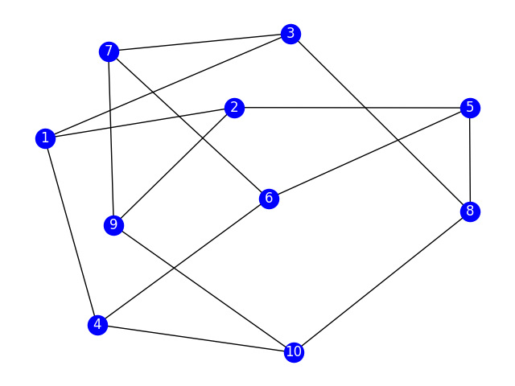
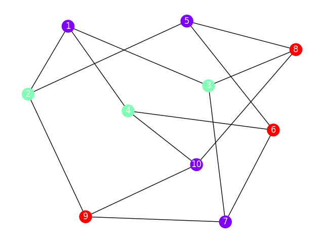

# Graph Coloring

In graph theory, graph coloring is a special case of graph labeling; it is an assignment of labels called colors to elements of the graph. Simply put, a coloring of the vertices of a graph such that no adjacent vertices share the same color is called vertex coloring.

# Motivation
In graph theory class, looking at graph coloring, We saw the greedy coloring algorithm and were asked to implement it in Python. This repository takes that implementation to the next level.

# Topics
You need basic knowledge in graph theory and have a clear understanding of the following:
## k-coloring

A k-coloring of a graph G is a labeling function
    
  - f: V(G) → S, where |S| = k.

The elements of S are the "colors."
Vertices with the same color form a color class.

## propper k-coloring
A k-coloring is proper if adjacent vertices have different labels:
      
  -  (∀u, v ∈ V(G))(u↔v → f(u) ≠ f(v))
# Visualization

For visualization using networkx and matplotlib, we create graphs of the following way:

- look the petersen graph non colored

    

- Same graph after find propper k-coloration

